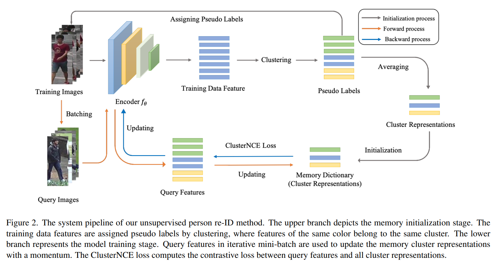
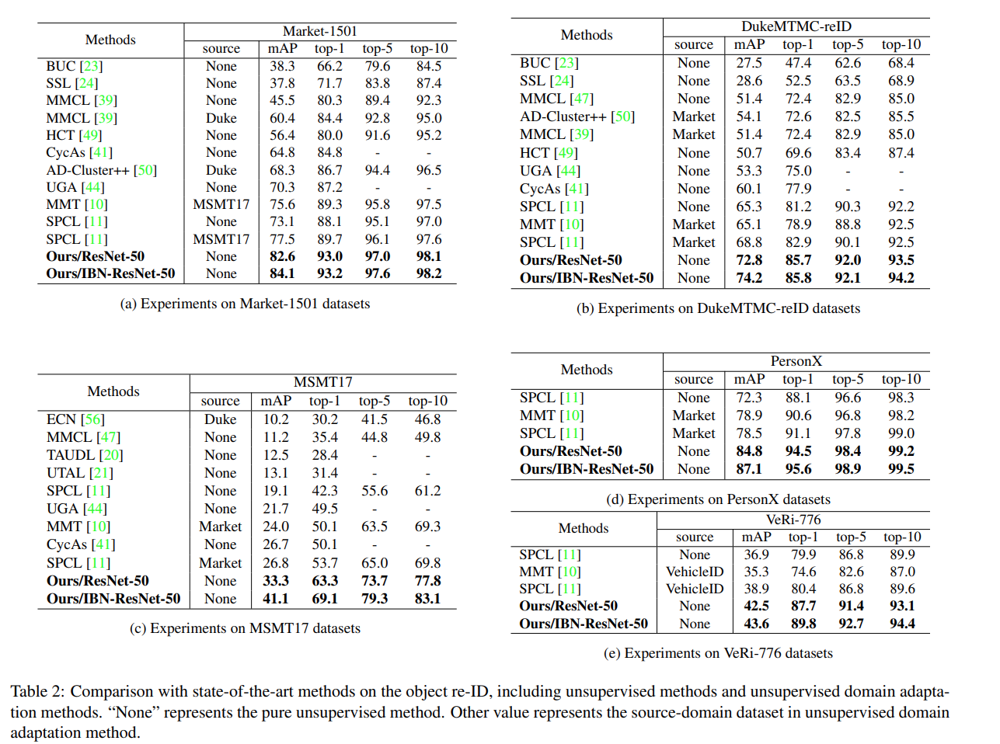

# Cluster Contrast for Unsupervised Person Re-Identification

The *official* repository for [Cluster Contrast for Unsupervised Person Re-Identification](https://arxiv.org/pdf/2103.11568v1.pdf). We achieve state-of-the-art performances on **unsupervised learning** tasks for object re-ID, including person re-ID and vehicle re-ID.

**Our unified framework**


## Requirements

### Installation

```shell
git clone http://gitlab.alibaba-inc.com/yixuan.wgy/ClusterContrast.git
cd ClusterContrast
python setup.py develop
```

### Prepare Datasets

```shell
cd examples && mkdir data
```
Download the person datasets Market-1501,MSMT17,PersonX,DukeMTMC-reID and the vehicle datasets VeRi-776 from [aliyun](https://virutalbuy-public.oss-cn-hangzhou.aliyuncs.com/share/data.zip).
Then unzip them under the directory like

```
ClusterContrast/examples/data
├── market1501
│   └── Market-1501-v15.09.15
├── msmt17
│   └── MSMT17_V1
├── personx
│   └── PersonX
├── dukemtmcreid
│   └── DukeMTMC-reID
└── veri
    └── VeRi
```

### Prepare ImageNet Pre-trained Models for IBN-Net

When training with the backbone of [IBN-ResNet](https://arxiv.org/abs/1807.09441), you need to download the ImageNet-pretrained model from this [link](https://drive.google.com/drive/folders/1thS2B8UOSBi_cJX6zRy6YYRwz_nVFI_S) and save it under the path of `examples/pretrained/`.

ImageNet-pretrained models for **ResNet-50** will be automatically downloaded in the python script.

## Training

We utilize 4 GTX-2080TI GPUs for training. For more parameter configuration, please check **`run_code.sh`**.

**examples:**

Market-1501:

```shell
CUDA_VISIBLE_DEVICES=0,1,2,3 python examples/cluster_contrast_train_usl.py -b 256 -a resnet50 -d market1501 --iters 200 --momentum 0.1 --eps 0.4 --num-instances 16
```
MSMT17:
```shell
CUDA_VISIBLE_DEVICES=0,1,2,3 python examples/cluster_contrast_train_usl.py -b 256 -a resnet50 -d msmt17 --iters 400 --momentum 0.1 --eps 0.7 --num-instances 16
```

DukeMTMC-reID:

```shell
CUDA_VISIBLE_DEVICES=0,1,2,3 python examples/cluster_contrast_train_usl.py -b 256 -a resnet50 -d dukemtmcreid --iters 200 --momentum 0.1 --eps 0.7 --num-instances 16
```

## Evaluation

We utilize 1 GTX-2080TI GPU for testing. **Note that**

+ use `--width 128 --height 256` (default) for person datasets, and `--height 224 --width 224` for vehicle datasets;

+ use `-a resnet50` (default) for the backbone of ResNet-50, and `-a resnet_ibn50a` for the backbone of IBN-ResNet.

To evaluate the model, run:
```shell
CUDA_VISIBLE_DEVICES=0 \
python examples/test.py \
  -d $DATASET --resume $PATH
```

**Some examples:**
```shell
### Market-1501 ###
CUDA_VISIBLE_DEVICES=0 \
python examples/test.py \
  -d market1501 --resume logs/spcl_usl/market_resnet50/model_best.pth.tar
```

## Results



You can download the above models in the paper from [aliyun](https://virutalbuy-public.oss-cn-hangzhou.aliyuncs.com/share/cluster-contrast.zip) 

## Citation

If you find this code useful for your research, please cite our paper
```
@article{dai2021cluster,
  title={Cluster Contrast for Unsupervised Person Re-Identification},
  author={Dai, Zuozhuo and Wang, Guangyuan and Zhu, Siyu and Yuan, Weihao and Tan, Ping},
  journal={arXiv preprint arXiv:2103.11568},
  year={2021}
}
```

# Acknowledgements

Thanks to Yixiao Ge for opening source of his excellent works  [SpCL](https://github.com/yxgeee/SpCL). 