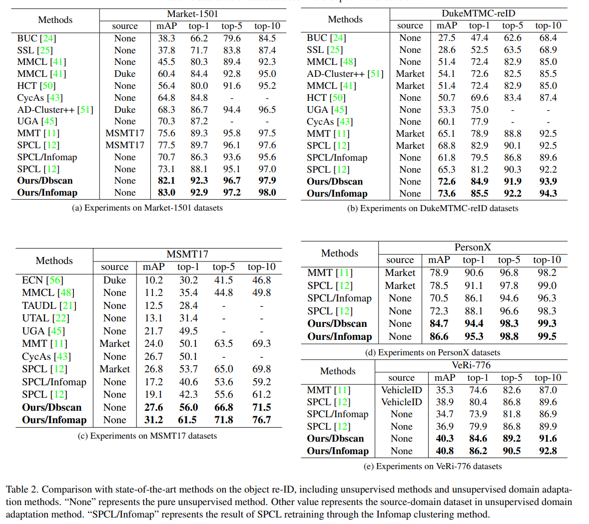

# Cluster Contrast for Unsupervised Person Re-Identification

The *official* repository for [Cluster Contrast for Unsupervised Person Re-Identification](https://arxiv.org/pdf/2103.11568v3.pdf). We achieve state-of-the-art performances on **unsupervised learning** tasks for object re-ID, including person re-ID and vehicle re-ID.

**Our unified framework**

## Updates

***11/19/2021***

1. Memory dictionary update changed from bath hard update to momentum update. Because the bath hard update is sensitive to parameters, good results need to adjust many parameters, which is not robust enough.


2. Add the results of the InforMap clustering algorithm. Compared with the DBSCAN clustering algorithm, it can achieve better results. At the same time, we found through experiments that it is more robust on each data set.

## Notes

In the process of doing experiments, we found that some settings have a greater impact on the results. Share them here to prevent everyone from stepping on the pit when applying our method.

1. The dataloader sampler uses RandomMultipleGallerySampler, see the code implementation for details. At the same time, we also provide RandomMultipleGallerySamplerNoCam sampler, which can be used in non-ReID fields.

2. Add batch normalization to the final output layer of the network, see the code for details.

3.  we obtain a total number of P × Z images in the mini
batch. P represents the number of categories, Z represents the number of instances of each category. mini batch = P x Z, P is set to 16, Z changes with the mini batch. 

## Requirements

### Installation

```shell
git clone https://github.com/alibaba/cluster-contrast-reid.git
cd ClusterContrast
python setup.py develop
```

### Prepare Datasets

```shell
cd examples && mkdir data
```
Download the person datasets Market-1501,MSMT17,PersonX,DukeMTMC-reID and the vehicle datasets VeRi-776 from [aliyun](https://virutalbuy-public.oss-cn-hangzhou.aliyuncs.com/share/data.zip).
Then unzip them under the directory like

```
ClusterContrast/examples/data
├── market1501
│   └── Market-1501-v15.09.15
├── msmt17
│   └── MSMT17_V1
├── personx
│   └── PersonX
├── dukemtmcreid
│   └── DukeMTMC-reID
└── veri
    └── VeRi
```

### Prepare ImageNet Pre-trained Models for IBN-Net

When training with the backbone of [IBN-ResNet](https://arxiv.org/abs/1807.09441), you need to download the ImageNet-pretrained model from this [link](https://drive.google.com/drive/folders/1thS2B8UOSBi_cJX6zRy6YYRwz_nVFI_S) and save it under the path of `examples/pretrained/`.

ImageNet-pretrained models for **ResNet-50** will be automatically downloaded in the python script.

## Training

We utilize 4 GTX-2080TI GPUs for training. For more parameter configuration, please check **`run_code.sh`**.

**examples:**

Market-1501:

1. Using DBSCAN:
```shell
CUDA_VISIBLE_DEVICES=0,1,2,3 python examples/cluster_contrast_train_usl.py -b 256 -a resnet50 -d market1501 --iters 200 --momentum 0.1 --eps 0.6 --num-instances 16
```


2. Using InfoMap:
```shell
CUDA_VISIBLE_DEVICES=0,1,2,3 python examples/cluster_contrast_train_usl_infomap.py -b 256 -a resnet50 -d market1501 --iters 200 --momentum 0.1 --eps 0.5 --k1 15 --k2 4 --num-instances 16
```

MSMT17:

1. Using DBSCAN:
```shell
CUDA_VISIBLE_DEVICES=0,1,2,3 python examples/cluster_contrast_train_usl.py -b 256 -a resnet50 -d msmt17 --iters 400 --momentum 0.1 --eps 0.6 --num-instances 16
```

2. Using InfoMap:
```shell
CUDA_VISIBLE_DEVICES=0,1,2,3 python examples/cluster_contrast_train_usl_infomap.py -b 256 -a resnet50 -d msmt17 --iters 400 --momentum 0.1 --eps 0.5 --k1 15 --k2 4 --num-instances 16
```

DukeMTMC-reID:

1. Using DBSCAN:
```shell
CUDA_VISIBLE_DEVICES=0,1,2,3 python examples/cluster_contrast_train_usl.py -b 256 -a resnet50 -d dukemtmcreid --iters 200 --momentum 0.1 --eps 0.6 --num-instances 16
```

2. Using InfoMap:
```shell
CUDA_VISIBLE_DEVICES=0,1,2,3 python examples/cluster_contrast_train_usl_infomap.py -b 256 -a resnet50 -d dukemtmcreid --iters 200 --momentum 0.1 --eps 0.5 --k1 15 --k2 4 --num-instances 16
```

VeRi-776

1. Using DBSCAN:
```shell
CUDA_VISIBLE_DEVICES=0,1,2,3 python examples/cluster_contrast_train_usl.py -b 256 -a resnet50 -d veri --iters 400 --momentum 0.1 --eps 0.6 --num-instances 16 --height 224 --width 224
```

2. Using InfoMap:
```shell
CUDA_VISIBLE_DEVICES=0,1,2,3 python examples/cluster_contrast_train_usl_infomap.py -b 256 -a resnet50 -d veri --iters 400 --momentum 0.1 --eps 0.5 --k1 15 --k2 4 --num-instances 16 --height 224 --width 224
```

## Evaluation

We utilize 1 GTX-2080TI GPU for testing. **Note that**

+ use `--width 128 --height 256` (default) for person datasets, and `--height 224 --width 224` for vehicle datasets;

+ use `-a resnet50` (default) for the backbone of ResNet-50, and `-a resnet_ibn50a` for the backbone of IBN-ResNet.

To evaluate the model, run:
```shell
CUDA_VISIBLE_DEVICES=0 \
python examples/test.py \
  -d $DATASET --resume $PATH
```

**Some examples:**
```shell
### Market-1501 ###
CUDA_VISIBLE_DEVICES=0 \
python examples/test.py \
  -d market1501 --resume logs/spcl_usl/market_resnet50/model_best.pth.tar
```

## Results



You can download the above models in the paper from [aliyun](https://virutalbuy-public.oss-cn-hangzhou.aliyuncs.com/share/cluster-contrast.zip) 


## Citation

If you find this code useful for your research, please cite our paper
```
@article{dai2021cluster,
  title={Cluster Contrast for Unsupervised Person Re-Identification},
  author={Dai, Zuozhuo and Wang, Guangyuan and Zhu, Siyu and Yuan, Weihao and Tan, Ping},
  journal={arXiv preprint arXiv:2103.11568},
  year={2021}
}
```

# Acknowledgements

Thanks to Yixiao Ge for opening source of his excellent works  [SpCL](https://github.com/yxgeee/SpCL). 
